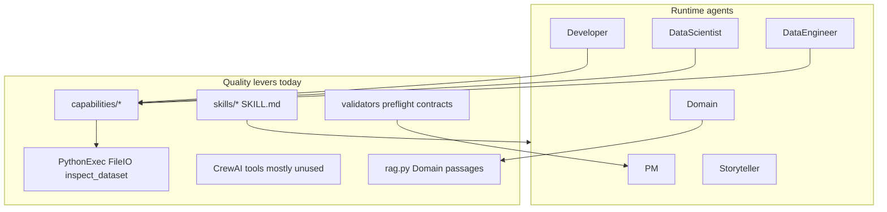
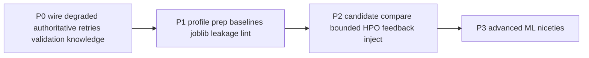

# MAADS tools, skills, and capabilities — improvement analysis

## Current architecture (baseline)

MAADS already separates **LLM judgment** from **deterministic execution** well:

| Layer | What exists | Reality |
|---|---|---|
| **CrewAI tools** | `read_case_config_summary`, `validate_submission_file` in [`crew_tools.py`](src/maads/crew_tools.py) | Registered but optional; real work is not tool-loops |
| **Sandbox tools** | `PythonExec`, `FileIO`, `inspect_dataset` in [`tools.py`](src/maads/tools.py) | The actual execution surface |
| **Capabilities** | Per-role `execution_evidence` → apply in [`capabilities/`](src/maads/capabilities/) | Correct CRISP-DM pattern; DE/DS still LLM-codegen-heavy |
| **Runtime skills** | 7 skills under [`skills/`](skills/) mapped in [`knowledge_setup.py`](src/maads/knowledge_setup.py) | Guidance text only — not enforced programmatically |
| **Knowledge/RAG** | [`rag.py`](src/maads/rag.py) + Loop D experience | Corpus thin; shared docs (`crisp-dm-excerpt.md`, `ml-problem-approach-notes.md`) referenced but often absent |
| **Safety nets** | NLP TF-IDF baselines; `execution_authoritative` skip-LLM; phase validators | Tabular has **no** modeling/submission fallback; `record_degraded` largely unwired |

Evidence from live runs ([`docs/Optimisation_Research.md`](docs/Optimisation_Research.md), Task 20): quality is less limited by missing AutoML than by **token/retry/latency tax** and **orchestration false loops**. DE alone can be 60%+ of spend; codegen + DEBUG stacks multiply failures into 7–10 LLM calls.

---

## Diagnosis (three lenses)

### 1. Data science / CRISP-DM quality

**Strengths:** config-driven `feature_hints` / `success_criterion`; structured `EvaluationBundle`; phase-3/4 validators feeding Loop B; Kaggle schema gate; NLP baseline; post-run `improvement_bundle` + workbook checklist.

**Weaknesses:**
- Modeling is **one authored script per 4.3**, not a candidate set; `representation_options` in YAML is never read by capabilities.
- Leakage/CV rules live in skill text, not code lint on prepared parquet.
- No model artifact persistence between 4.3/4.4 and 6.1 (workbook even warns of train/deploy drift).
- Tabular/regression path has no deterministic baseline (unlike NLP).
- EDA (2.3) and quality (2.4) are free-form LLM codegen instead of measured profiles.
- Submission contract checks columns/rows only — not dtypes, NaNs, or log-target scale.

### 2. Agentic software efficiency

**Strengths:** JSON contracts, `view_for` allowlists, `execution_authoritative`, token soft-limit gating DEBUG, recent prompt-redundancy work (PR #15).

**Weaknesses (highest leverage):**
- Double call pattern still common when execution is not authoritative (codegen text + JSON kickoff).
- Retry stack `MAX_CODE_RETRIES × MAX_DEBUG_RETRIES` + JSON repair.
- Skills are CrewAI-attached markdown; agents may ignore them under pressure.
- CrewAI `@tool`s duplicate deterministic logic and add unused tool-choice surface.
- Knowledge Loop D writes thin experience bullets — weak cross-run learning.
- Observability gaps (codegen tracing / token inflation) make optimization hard to trust.

### 3. Platform / ops

Wall-clock and effort defaults (Task 20 class), missing default `MAX_TOKENS_RUN`, CI without pytest — these are reliability levers, not ML tools, but they dominate hosted “quality” perception.

---

## Recommended additions (prioritized)

Concrete approach: **prefer deterministic capabilities and validators over new CrewAI tools**; **promote skill text into enforceable contracts**; **add baselines/libraries before AutoML**. Do not add a free-form agent tool marketplace — it fights the hub-and-spoke Flow design.

### Tier P0 — Apply / wire what you already almost have (quality + cost)

| Add / apply | Kind | Where | Why |
|---|---|---|---|
| **Wire `record_degraded` on baseline/fallback** | Capability | [`codegen.py`](src/maads/codegen.py) → [`shared.record_degraded`](src/maads/capabilities/shared.py) | Loop B docs assume degraded signals; today flags often empty |
| **Maximize `execution_authoritative` coverage** | Capability | DE 2.1/2.2/2.4, DS when contract-complete | Removes second LLM call (~30–40% token cut per Optimisation_Research) |
| **Tiered retry budgets by substep** | Capability/config | [`codegen.py`](src/maads/codegen.py), [`debug.py`](src/maads/debug.py) | Describe/collect should fail fast to rules; keep retries for 3.2–3.5 / 4.3 |
| **Deterministic submission validation after 6.1** | Tool→capability | Call logic from `validate_submission_file` inside [`developer.build_submission`](src/maads/capabilities/developer.py) | Stop relying on LLM tool choice |
| **Fill knowledge corpus** | Knowledge | `knowledge/crisp-dm-excerpt.md`, `ml-problem-approach-notes.md`, per-case `.md` | RAG already built; corpus is the missing piece |
| **Enrich Loop D experience template** | Capability + skill | [`developer.experience_review`](src/maads/capabilities/developer.py) | Capture failing substeps, degraded reasons, winning technique, validator findings — usable next-run RAG |

### Tier P1 — New deterministic capabilities (biggest ML quality jump)

| Addition | Kind | Design |
|---|---|---|
| **`profile_dataset` capability** | Capability (replace/augment 2.1–2.4 codegen) | Extend `inspect_dataset` into full profile: missingness, cardinality, target balance, train/test schema diff, constant cols, duplicate IDs → write DU reports without LLM authoring |
| **Config-driven prep library** | Capability + skill upgrade | Implement [`tabular-prep`](skills/tabular-prep/SKILL.md) / [`nlp-prep`](skills/nlp-prep/SKILL.md) as Python (impute/encode/TF-IDF path from `feature_hints`); LLM only for residual columns or novel transforms |
| **Tabular/regression baselines** | Capability | Mirror NLP: sklearn Pipeline registry already sketched in [`reports/workbook.py`](src/maads/reports/workbook.py) (RF / HGB / Ridge) — use as 4.3/4.4/6.1 fallback |
| **`joblib` model artifact at 4.3** | Capability | Persist fitted pipeline; 4.4 scores it; 6.1 loads it — closes train/deploy gap |
| **Programmatic leakage lint** | Validator (+ skill stays as docs) | Pre–phase-4 checks: target in features, ID as predictor, perfect CV ceiling already in validators, optional near-duplicate rows; feed `validator_findings` |
| **Honor `representation_options`** | Capability | When listed (e.g. disaster_tweets), try options in order with budget; stop inventing one-off pipelines |

### Tier P1 — New / upgraded runtime skills (enforceable, not just prose)

| Skill | Action |
|---|---|
| **`eda-contract`** (new) | Fixed JSON schema for 2.3 exploration outputs (imbalance, top correlations, leakage suspects) |
| **`modeling-baseline-ladder`** (new) | Ordered techniques per `problem_type` + when to escalate (baseline → HGB → limited HPO) |
| **`tabular-prep` / `nlp-prep`** | Expand from 5–6 bullets into contracts that match the prep library API |
| **`leakage-cv-discipline`** | Keep for LLM; duplicate critical rules into `validators.py` |
| **Assign `tabular-prep` to Data Scientist** | Today only DE loads it ([`knowledge_setup.py`](src/maads/knowledge_setup.py)) |
| **`json-output-contract`** | Keep; strengthen deterministic repair before Developer DEBUG |

### Tier P2 — New tools (narrow, deterministic wrappers — not free-form agent tools)

Prefer **capability-invoked** tools over CrewAI `@tool` (agents ignore tools under load):

| Tool | Consumer | Purpose |
|---|---|---|
| **`validate_prepared_parquet`** | Phase-3 exit / pre-4.3 | Target present, predictor count, dtypes, no all-null columns |
| **`score_cv_pipeline`** | DS 4.3/4.4 | Shared stratified/KFold + metric dispatcher (one implementation) |
| **`build_submission_from_artifact`** | Dev 6.1 | Load joblib + write CSV matching sample |
| **`compare_candidates`** | Optional 4.3 multi-run | Score N techniques, pick max `cv_score` into `md.models` |
| **Optional: bounded Optuna/FLAML search** | Config flag only | `model_search: {budget_trials: N}` — never unbounded AutoML by default |

Deprecate or stop expanding CrewAI `@tool` surface until tool-call telemetry shows real usage.

### Tier P2 — Knowledge / feedback loop upgrades

| Addition | Why |
|---|---|
| **Structured `improvement_bundle` → next-run hints** | Inject top sandbox failures + winning technique into DE/DS view (not only Domain RAG) |
| **Per-case playbooks in `knowledge/<case>.md`** | Domain + DE hints without hardcoding case_id in Python |
| **Storyteller “quality appendix”** | Surface segment errors / calibration notes from bundle into final report (documentation only; no new loop) |

### Tier P3 — Deliberately defer (low ROI for this design)

- Full AutoML platforms, feature stores, SHAP-as-default, stacking as a new phase, agent-to-agent delegation, web search tools, unrestricted shell tools.
- More CrewAI multi-agent crews replacing the Flow — would fight current testability and JSON contract model.
- Heavy EDA UIs inside the pipeline (dashboard already exists for traces).

---

## Suggested implementation sequence (if approved later)

1. **P0** — no new ML libraries; wire and shrink LLM surface; fill knowledge.
2. **P1** — deterministic prep/profile/baselines + model artifact — largest quality+cost win aligned with CRISP-DM phases 2–4–6.
3. **P2** — multi-candidate and optional search behind YAML knobs; close cross-run learning.
4. Validate each tier with `test_path_coverage` + one live case (titanic tabular, disaster_tweets NLP).

---

## Design constraints to preserve

- Case variance only in YAML / knowledge — never `if case_id == ...` in capabilities.
- Prefer capability + validator over new LLM tools.
- Skills teach agents; **validators enforce**.
- Keep one-agent-per-substep JSON kickoff; do not reintroduce multi-task sequential crews for core path.

---

## Verdict

The highest-value “tools and skills” are not more agent plugins — they are **deterministic capability libraries that implement what the skills already say**, plus **validators that make those rules real**. NLP already proves the pattern (TF-IDF baseline). Extending that pattern to tabular prep, profiling, modeling baselines, joblib handoff, and leakage lint — while wiring degraded flags and authoritative execution — will improve ML quality and cut cost more than adding AutoML or new CrewAI tools.
